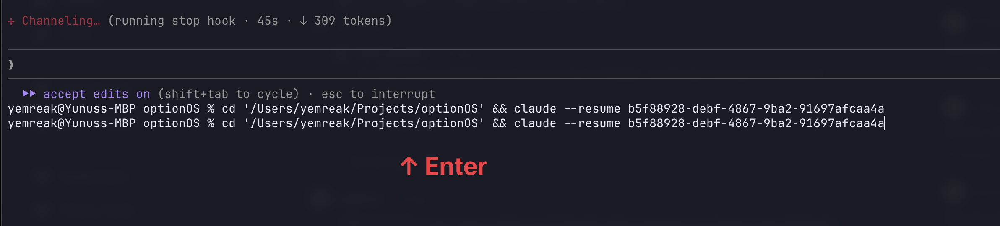

# claude-cpu-guard

Claude Code uses React/Ink for its terminal UI. Sometimes the render loop gets stuck and burns CPU even when idle. This plugin detects it and kills the stuck process automatically.



After killing, it prints the resume command. Press `↑ Enter` to restart your session.

## Why?

Claude Code's TUI runs a React scene graph at 60fps — layout, rasterize, diff, generate ANSI — all for a terminal that only changes when you type or receive output. When this render loop gets stuck, your CPU melts while Claude sits idle.

- [Reddit: "Does anyone face high CPU usage when using Claude?"](https://www.reddit.com/r/ClaudeAI/comments/1qt1f5y/does_anyone_face_high_cpu_usage_when_using_claude/)
- [ThePrimeagen: "Claude Code's TUI is Ridiculous"](https://www.youtube.com/watch?v=LvW1HTSLPEk)

## Install

In Claude Code, run:

```
/plugin marketplace add yemreak/claude-cpu-guard
/plugin install claude-cpu-guard@claude-cpu-guard
```

Or clone manually:

```bash
git clone https://github.com/yemreak/claude-cpu-guard ~/.claude/plugins/claude-cpu-guard
```

That's it. No config needed. **macOS only** for now — Linux and Windows contributions welcome.

## How it works

Three hooks, one script, zero config:

| Event | Action |
|---|---|
| `SessionStart` | Caches session ID |
| `UserPromptSubmit` | Marks state as "working" (won't kill) |
| `Stop` | Marks state as "stopped" → starts 30s CPU watch |

Kill only happens when **all 6 checks** (every 5s for 30s) show CPU > 70% while state is "stopped". If you type anything during that window, the kill is cancelled.

## Uninstall

```
/plugin uninstall claude-cpu-guard@claude-cpu-guard
```

Or remove manually:

```bash
rm -rf ~/.claude/plugins/claude-cpu-guard
```

## License

MIT
